## Fault Diagnosis in unknown model DES

### project structures

```text
.
├── data_preprocessing
├── dataset             # Stores processed running logs (compressed)
├── encoding-configs    # stores config for encoding new come running logs
├── images              # images for README.md
├── models              # DL models
├── README.md
└─── requirements.txt

python version : 3.7.4
```

使用深度学习方法，基于 DES (离散事件系统) 生成的日志 (running logs) 来进行错误诊断，本质上是一个序列 (sequence) 的分类 (classification) 问题 .

> 即找寻适合该反复分类问题的机器学习方法，完成该任务。重点看如何借鉴已有对文本序列进行分类的例子，CNN (Convolution Neural Network) 或 RNN (Recurrent Neural Network) 可能可行。


### 1. Main Idea

Using one dimensional convolutional neural networks (CNNs), recurrent neural networks (RNNs) or long short term memory (LSTM)

RNNs and LSTM may does better than CNNs for this classification task.

'The state of art' are mainly used. If they don't work well, adjust them to our task.

### 2. 1D-CovNets

先尝试使用 1-DCovNets。当前尝试方案: 刚开始尝试使用产生的数据量较大，编译的模型非常复杂，训练时间非常长（先放弃尝试了）

> 折中方案：选择随机状态大小为 50 ～ 100， 随机生成的日志长度限制为 30 ～ 50， 则预处理编码后产生的矩阵表示为 [1, 50 x (observable_event_set_size + 1)\]
> 产生的日志，经处理后，只剩 3 万多条，用于训练模型。训练时间大概为几分钟。

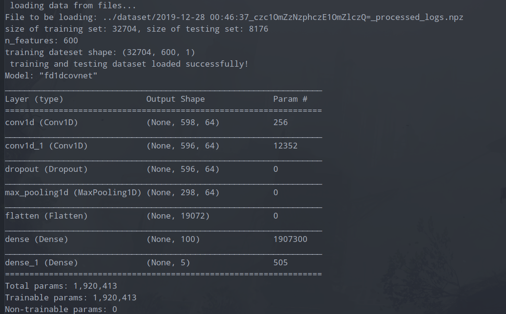
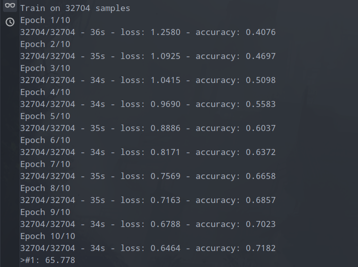

设置 ``epochs`` 为 100， 跑出来结果 (耗费时间 1 个多小时)

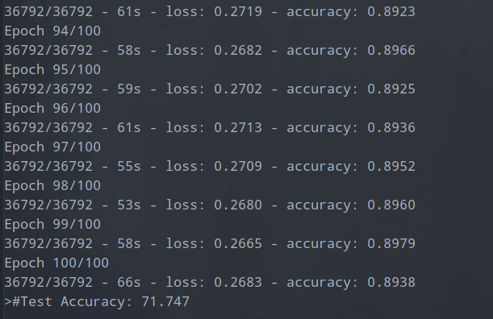

**REMARKS: 当前编译模型时使用的 optimizer 是 adam (SGD 的一个泛化版)， 至于 batch_size 的选择，参考 arxiv 上两篇文献:**
> 1. [Revisiting Small Batch Training for Deep Neural Networks](https://arxiv.org/abs/1804.07612)
> 2. [Practical recommendations for gradient-based training of deep architectures](https://arxiv.org/abs/1206.5533)
>
> epochs 数通过实验来进行确定，learning rate 综合 epochs, samples, batch_size 得到 error gradient updates (误差梯度更新) 数来确定。
>
> 对于更新数较大的，选择小 learning rate（这时，epochs 数一般不需要太多，利用 early stopping 早停法来获得模型最佳的效果）, 更新数小的，选择大 learning rate (一般需要更大的 epochs 数，以获得合适的 updates, 训练时间更长)
>
>
> 在代码实现中，使用 tf.keras API 只需要在 fit() 中引入 validation set 即可获得 history 数据 （每一个 epoch 的评估参数数据）, 然后通过简单地绘制成图，就能直观的看到情况。

#### CNN tuning

调整 CNN 中调整的超参数 (hyper-parameters)。

##### 1. 一次随意尝试

将 ``kernel_size`` 从 ``3`` 调整为 ``5``， ``pool_size`` 从 ``2`` 调整为 ``5``， 并在拟合模型时将输入的训练集划分一部分 (0.2) 作为 validation set (验证集)。

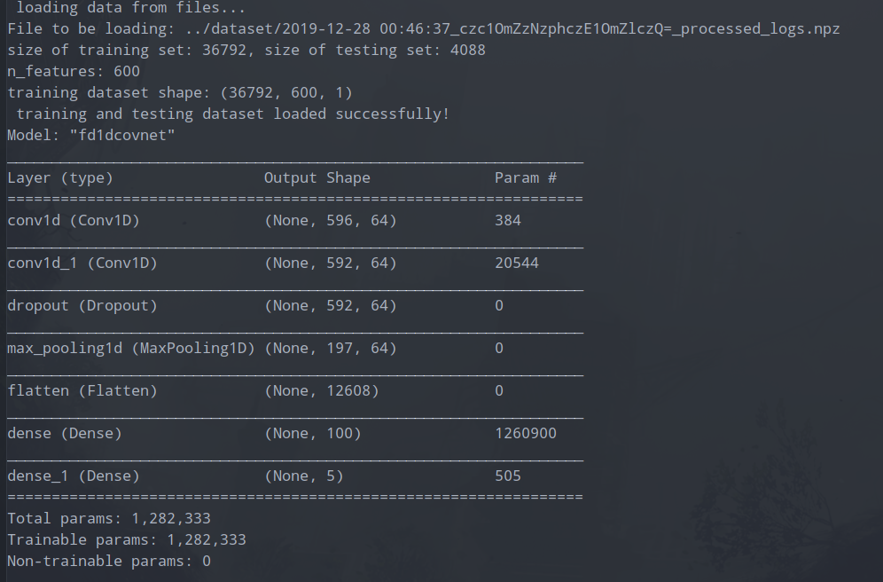
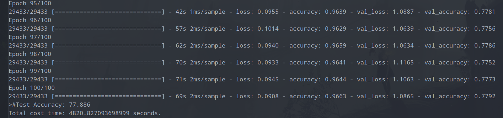

Using gpu to reduce time for training.

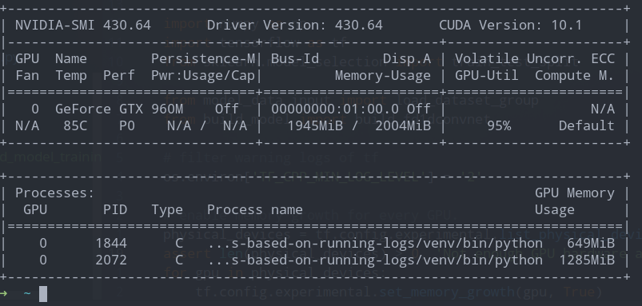
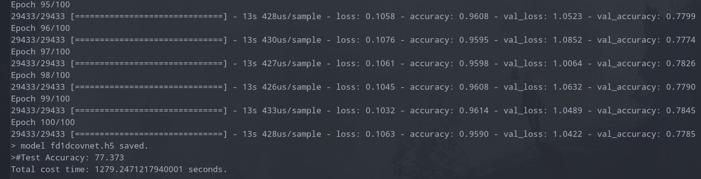

加载已保存的模型，并从原始日志集中选取若干日志进行测试，来看模型是否能够预测出正确的错误类型:

选取的测试日志 (需要经过压缩编码后，再输入给模型):
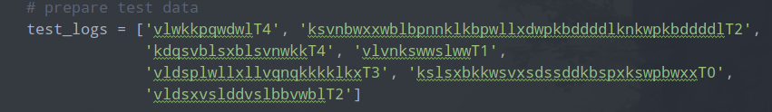

预测情况如下：
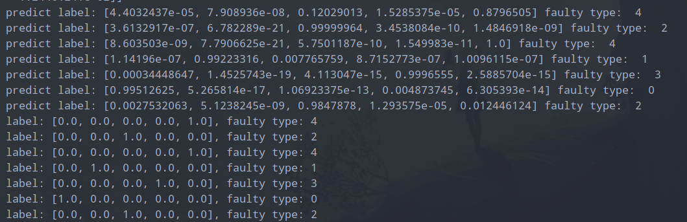

> NOTICE: 可以看到，所有日志的预测结果都正确，但之前对模型的训练时的评估来看，我们选取的测试日志，很可能就是模型训练集中的样本。
> 因为在数据预处理时，由于每种类别的日志数量不均衡，进行了 over-sampling 以及 under-sampling， 之后再进行打乱 shuffle, 所以从原始的日志上看，无法知道那些是没用于训练的日志。（除非一开始就将原始数据进行划分）
>
> 从模型评估时模型在测试数据集上的表现 (准确率 77% 左右)来看，基本确定我们选取用于测试的数据应该就是包含于它的训练数据集中。🤔

##### 2. tuning number of filters

尝试调整 ``filters`` 数量 (产生的 feature map 数量)，将网络中所有 hyperparameters 调整为原始默认参数，并将 ``epochs`` 下调至 ``10``，减小迭代次数（减少训练所需的时间）
> 为了探索合适的 ``filters`` 大小，我们可以选取一个范围，小于初始值 ``64``的和大于初始值的。

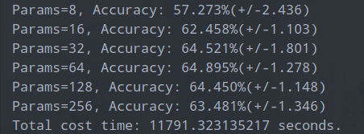
> 完成测试，耗费大概 3 个多小时。 图中，accuracy 准确率是 mean 均值，后面跟着的是 std (standard deviation) 标准差。

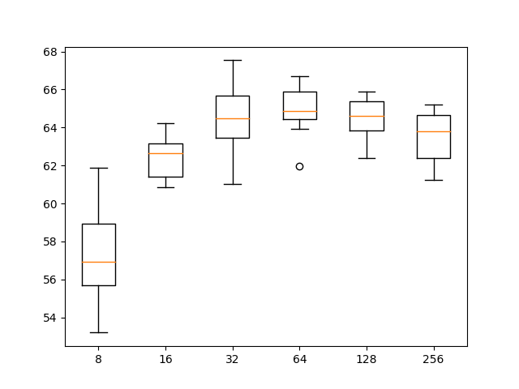
> 从上图可以看到，随着 ``filters`` feature map 的数量的增加，测试准确率中值（黄色的线）在不断上升，而在 ``64`` 之后反而开始下降，因此，或许 ``64`` 就是合适的值，它同时具备性能和稳定性。
>
> 这么看，模型刚开始选择的 ``64`` 就是比较合适的值。。。

##### 3. tuning kernel size

调整 ``kernel`` (卷积的核或 filter 过滤器大小)，核的大小控制每次读取序列时要考虑的时间步长 (time steps), 然后将时间步长投影 (project) 到 feature map (特征映射，此过程为卷积)。较大的核意味着对输入读取不那么严格。
> 同样，我们可以选择一个范围的 ``kernel_size`` 来进行测试，其中包含初始建立网络选择的值 ``3``。

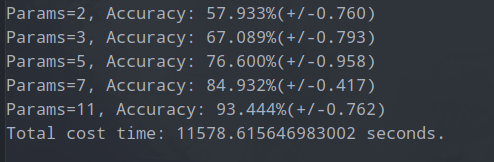
> 完成测试，所花费的时间还是 3 个多小时，测试集准确率是 mean 均值，后面是标准差。

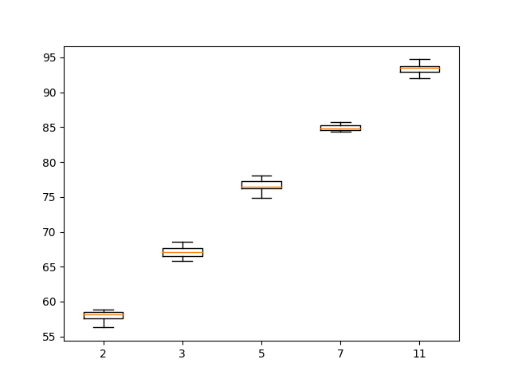
> 从该盒形图中可以明显看出，随着 ``kernel_size`` 的增加，测试准确率中值（黄色线）不断上升，且所有超参数取值对应的测试准确率稳定性非常好。
>
> 从测试来看，``kernel_size`` 取 ``11`` 具有非常不错的效果。
>
> NOTICE: 从图上看，似乎我们还可以尝试取一个比 ``11`` 还大的范围来进行测试，看能否获得更好的效果。
>
> REMARKS: 原因分析：我们知道 kernel size 卷积核的大小是确定时间步长的大小，影响的是对输入序列消息的读取，从效果上看，随着 kernel size 的增大，模型效果越好。可能原因是，输入的数据从原始数据经过编码表示后，是一个维度较高且非常细稀疏的 tensor。适当增大 kernel size 反而能够更好处理这样的数据。

使用比上面 ``11`` 更大的一个范围再次进行测试，结果如下:

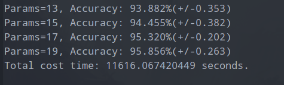
> 耗时 3 个多小时，可以看到，测试精准率均值都非常高，且它们的稳定性都很好。

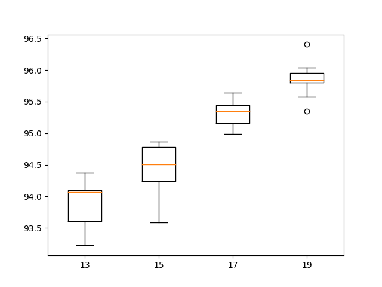
> 从该图中看的话，``kernel`` 取 ``19`` 是最好的。
>
> 因为，随着 kernel size 的增加，测试精准率中值（黄色线）不断上升，意味着，可能还有上升空间，因此可以再次设计实验了测试一组更大的 kernel size。

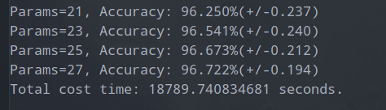
> 耗费 5 个多小时，随着 kernel size 的增大，训练时间变长。

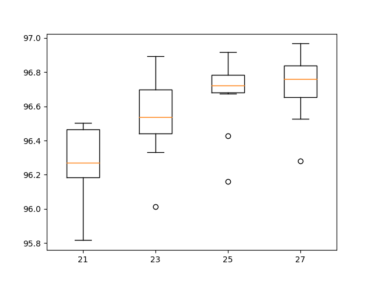
> 从图中，可以看到，随着 kernel size 的增大，测试集精准率中值（黄色线）不断上升，虽然图中有些许离群点 (outlines)。
>
> 表现最好的是 ``27`` 大小 kernel size 的情况。
>
> 从上图看，我们还可以再次设计一个更大的范围进行实验。。。


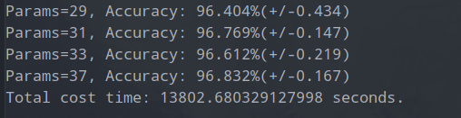
> 耗时将近 4 个小时。

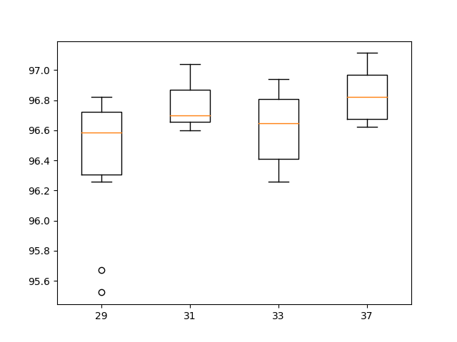
> 相比于之前的值 ``27``, 除了 ``29`` 有两个表现不是很好的离群点外，其他的所有测试结果都比 ``27`` 的要好，这次测试中表现最好的是 ``37``。
>
> 这么看，我们还是可以再设计实验来探索更好的 kernel size 取值。

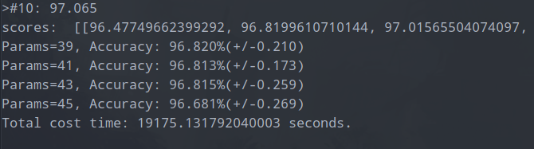
> 耗时 5 个多小时。

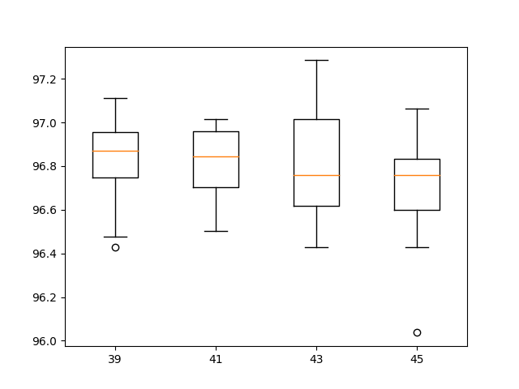
> 从实验数据上看的话，它们的表现效果都挺不错（但 50% 点，即黄色线从 41 开始逐渐下降了）
>
> 后续更大的取值范围实验就不做了，估计也不会再有很大的提升了。


从对 kernel size 的测试结果来看，kernel size 取 ``31``, ``37``, ``39``, ``41``, ``43`` 都不错的选择。
> 我们可以在选择这些 kernel size 的情况下，来探索 ``filters`` 的其他可能取值（当前使用的 64），来看有没有更好的效果。

###### re-Testing filters

在选择上面获得较好效果的 kernel size 的情况下，再次调整 filters 的数量，看能否获得更好的效果。

1. 针对与 kernel_size = ``31``, filters 测试范围 ``[8, 16, 32, 48]``


> 大概 4 个小时。

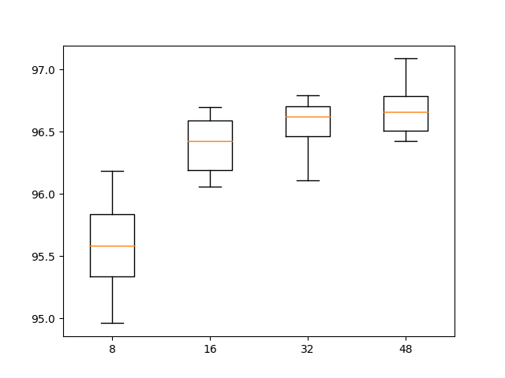
> 可以看到，虽然相比 ``filters=64`` 的效果是差了点，但是明显可以了解到在 ``kernel_size=31`` 的情况下，就算 feature map 的数量叫少，模型还能保持不错的效果。**一个趋势是随着 filters 的增加，测试精准率中值 (黄色线)不断上升，这意味着提高 filters 取值是能够提高模型的性能的**
>
> 接下来，我们还可以试试如果提高 filters 的取值，模型能否获得更好的效果。

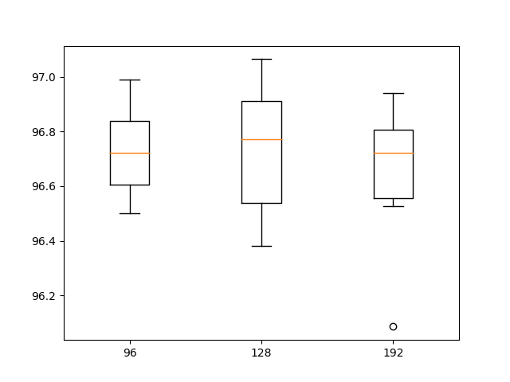
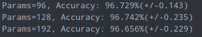
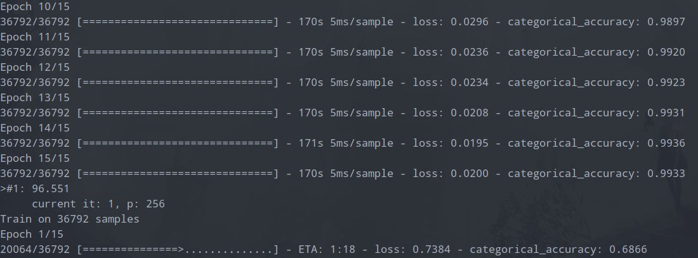
> 本来是用包含 ``256`` 的，但是前三个项跑，已经花了 9 个多小时，而根据 ``256`` 中一次 epoch 所需的时间来看，它估计最少需要 7 个小时。
>
> 从第一次完整训练效果来看，也估计不会太好的效果，所以不跑了。


**需要注意的是，上面的所有调优都是固定其他 hyper-parameter, 然后再探索某个参数的最优值，最后组合形成的效果可能并不是真正的最优。**

**例如：多个参数一起可以形成不同的组合，(如在确定了最优 kernel size 后，再次看在不同 filters 下此 kernel size 的效果) 等等。且实验中，测试是重复 10 次来看稳定性，我们还可以适当提高重复次数，再看看稳定性。**

#### Applying models defined above to more complicate task

使用之前探索出来的模型结构，应用到日志压缩处理表示更长的情况 (之前是 50 编码后最长表示为 600, 下面使用的是 100, 编码后最长表示为 1400)。

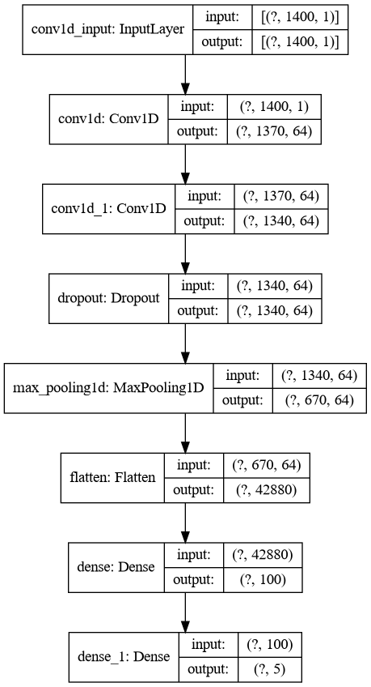
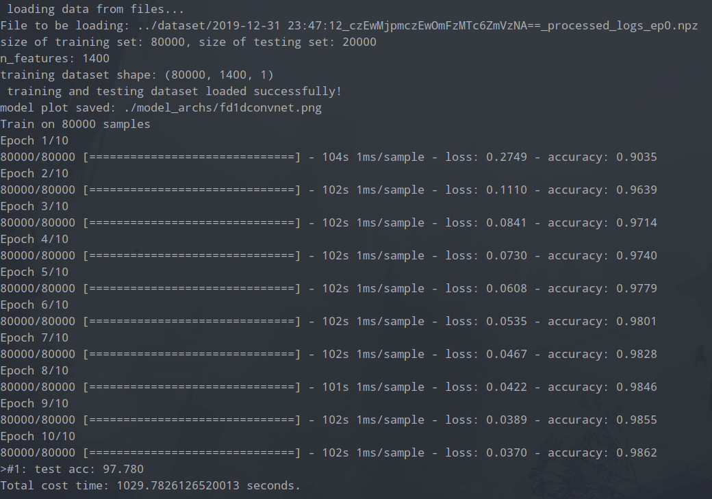
> 模型仍能表示出不错的效果，需要注意的是虽然日志的表示长度不同，但它们的日志编码映射 (encoding mapping) 的最长表示是接近的。（因为它们 DFA 的 observable events set 的大小相近）
>
> 即它们的日志编码过后，使用的 vector 表示的稀疏程度相近。(通过之前的测试，如果遇到有更长 encoding mapping 的情况，可适当提高 kernel size 的大小，再对kernel size 进行范围取值测试，测试不同更大取值情况下的性能和稳定性)

> NOTICE: 存在的一个问题，由于当前采用的 over sampling / under sampling 处理是在处理原始日志数据的时候，因此在分批次存放已处理并压缩后的日志数据后，如果不是使用所有数据文件来对模型进行训练的话，读取若干个文件，仍可能出现 imbalance 问题。
> REMARKS: 从当前模型的训练的表现来看，应该考虑将 over-sampling / under sampling 处理放到模型训练之前，读取训练数据之后，这样更合理。
>
> Code Refactoring is needed.

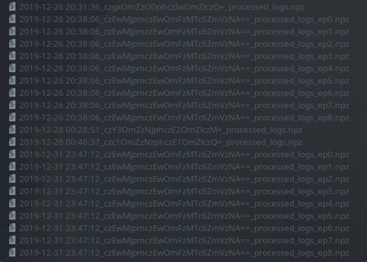


#### Multi-Channel (head) CNN

multi-head cnn （选择不同 kernel size 的 conv 层做 feature map 的提取，在 flatten 层之后再将它们全部 concatenate 拼接在一起）

##### 1. 简单尝试

网络结构如下:

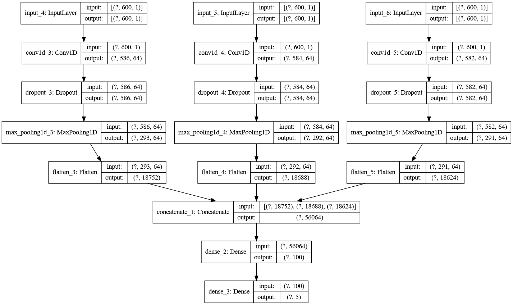
> 三个 head 使用 filters 均为 ``64``, 使用的 kernel size 分别为 ``15``, ``17``, ``19``，且只有一层卷积层。pool_size 均为 ``2``， ``dropout`` 都是 ``0.5``。

由于是一次随意的尝试，先不考虑训练出来的模型的稳定性，优先考虑性能，只做一次训练，结果如下:
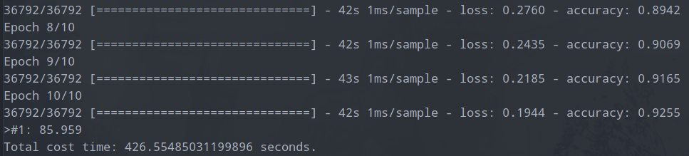
> 训练 10 epochs 后，可以看到效果还行，估计还有很大提升空间，可以在对网络的结构进行调整。

##### 2. multi-channel with 2 conv layers

调整上面的网络结构，使用两层卷积层，并调整三个不同 head 的 kernel size 为 ``17``, ``19``, ``21``。


训练结果如下:


> 效果其实和只使用一个 head (kernel size 为 17， 19， 或者 21) 的 1dconvnet 的效果表现其实差不多。
>
> REMARKS: 后续测试可以测试稳定性，以及对不同的 head 的 kernel size 再作出调整。

**NOTICE: 网络结构变复杂后，模型拟合达到好的效果，所需的数据量会大幅度增加，因此我们还可以尝试适当增加 epochs 的数量 (以上实验中使用 epoch 数量都控制在 10 左右，主要想快速衡量模型的优秀程度)**

下面给出的是，一些网络结构调整过后的测试一次测试结果（epochs 不定）


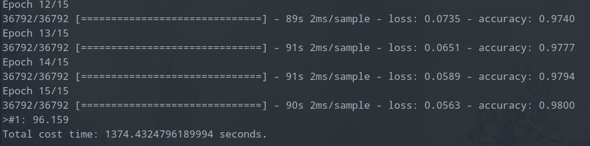

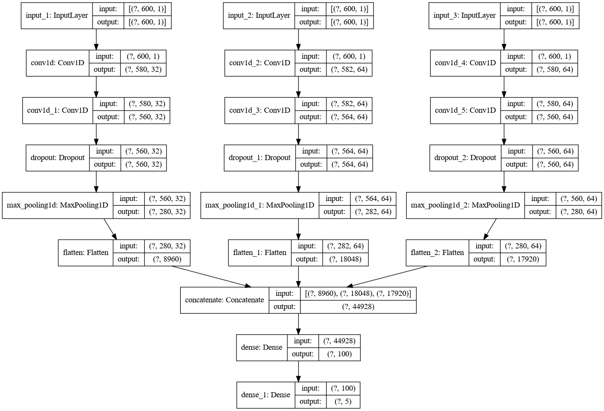
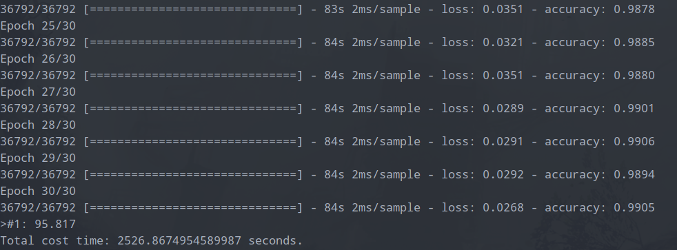

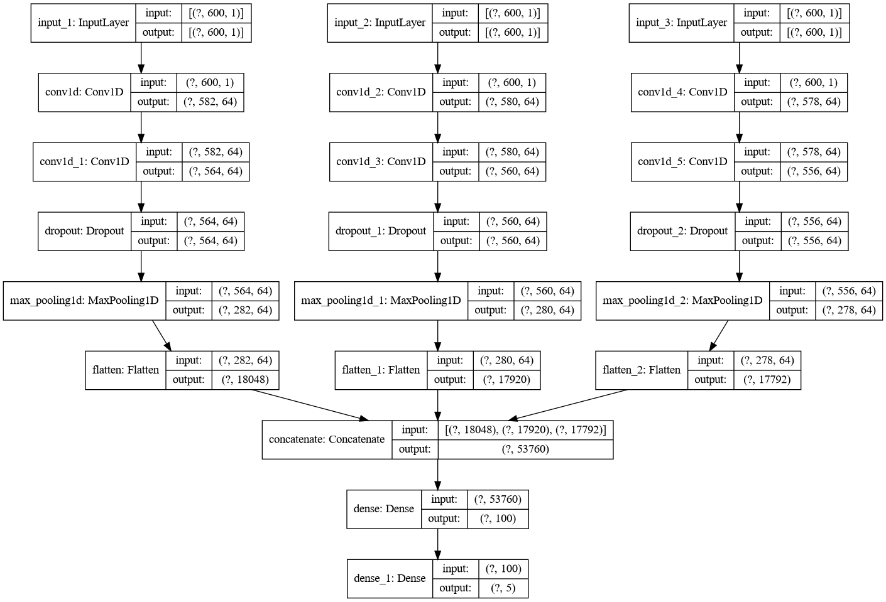
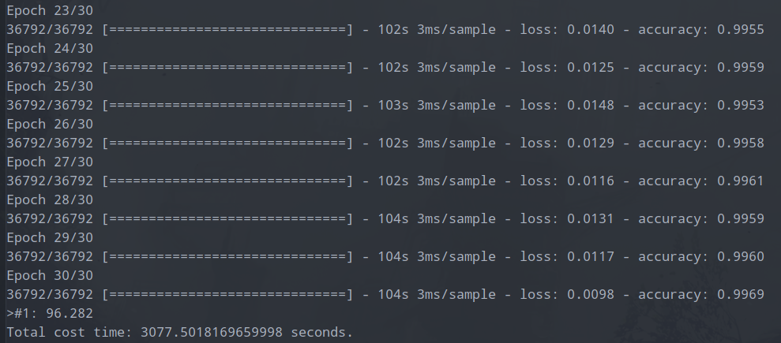

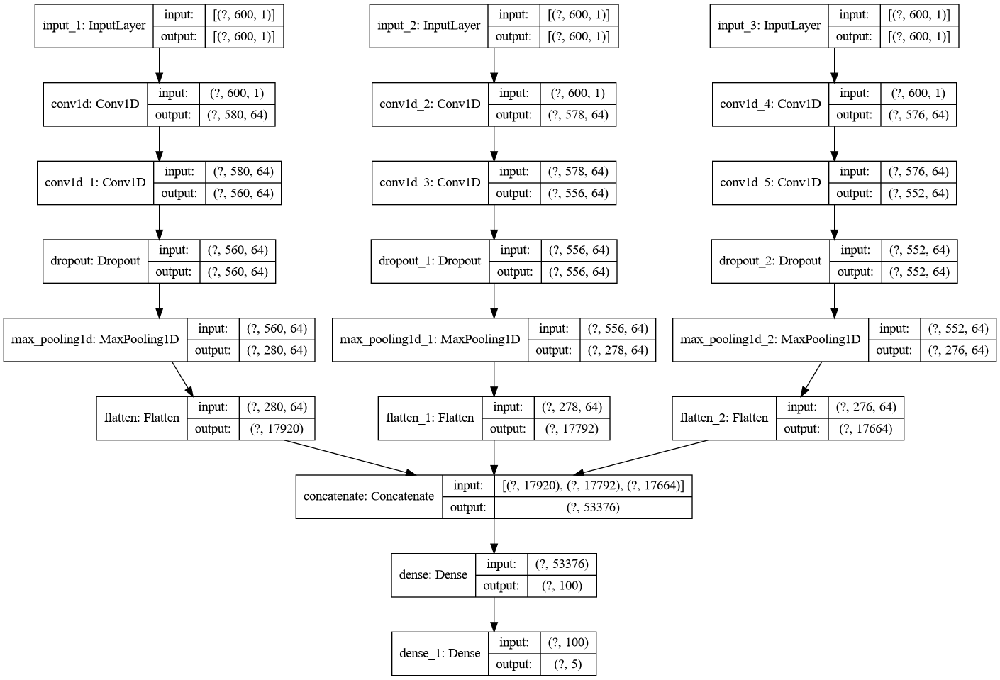
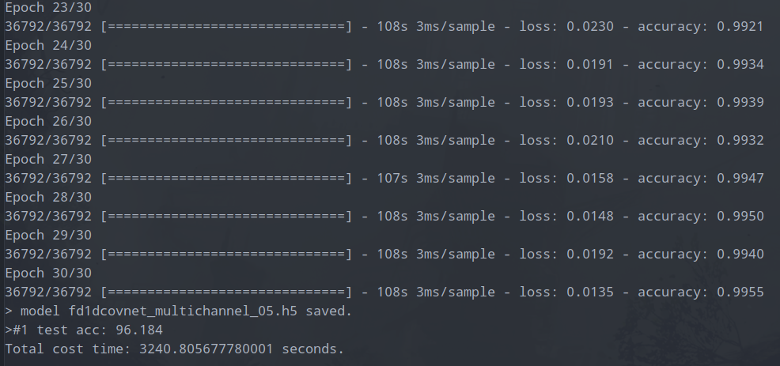

选择上面探索出来的比较好的 filters 和 kernel size 的取值，进行组合。

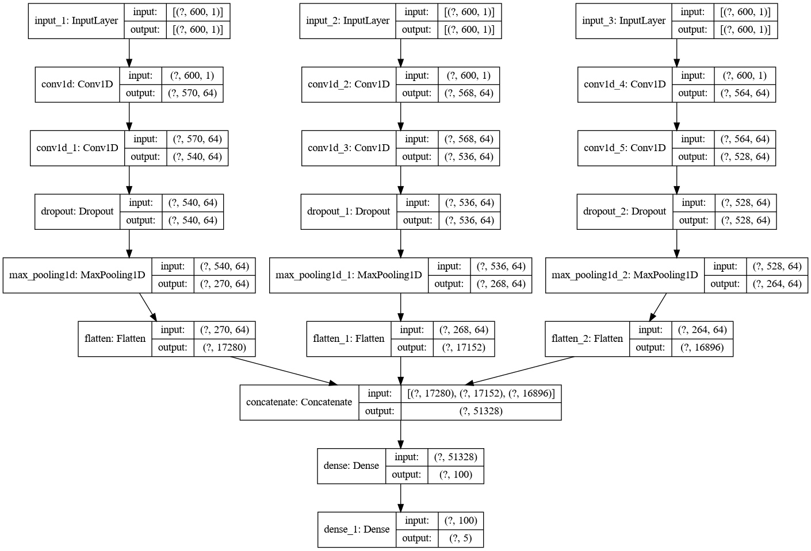
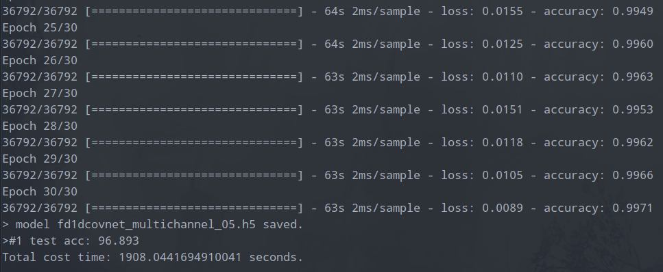
> 效果是好了一点。


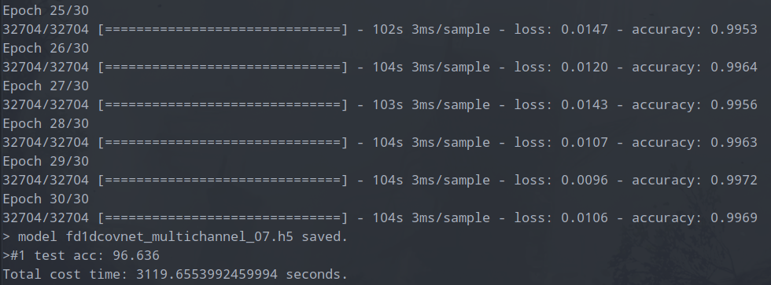
> 这次训练中选择的 kernel size 组合也是从上面实验获得的不错的取值，然后也对测试集进行了修改（增加到了 0.2 即 20%， 之前是 0.1）

使用 validation set 并收集训练时的数据，绘制图形。
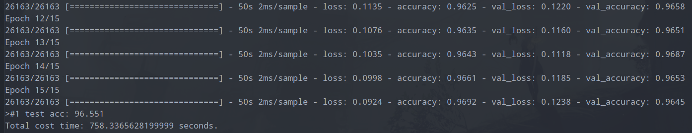
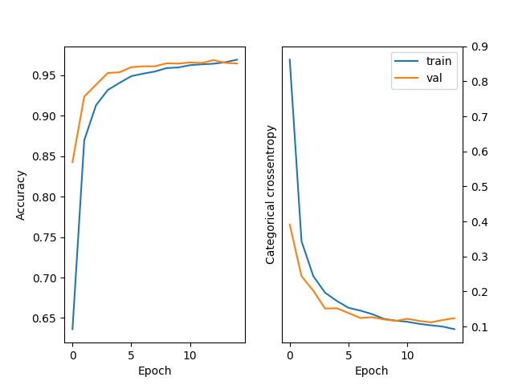
> 表明该模型当前使用的超参数已经是挺不错的了。
>
> 可再设计一个 epochs 数量更大的实验来做对比 (看什么时候开始模型开始过拟合, over-fitting)。

### 3. RNNs

#### Simple RNN or GRN

#### LSTM

可先尝试只使用 LSTM 的方案。

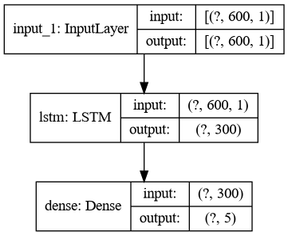
> 训练出来的模型效果非常差，根本没有拟合训练提供的数据, 且训练时间非常长, 1 epoch 需要十几分钟。
> 后续需要对结构进行调整。

尝试 CNN 中添加 LSTM 层的结构。

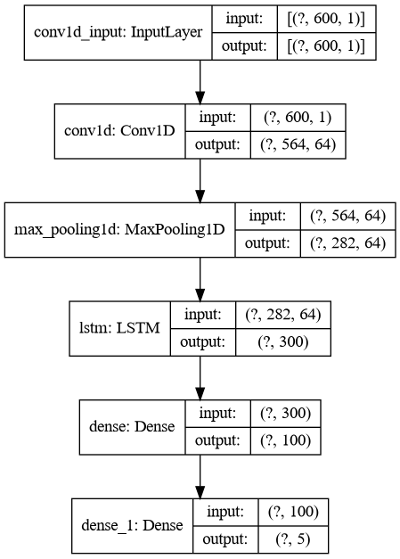]
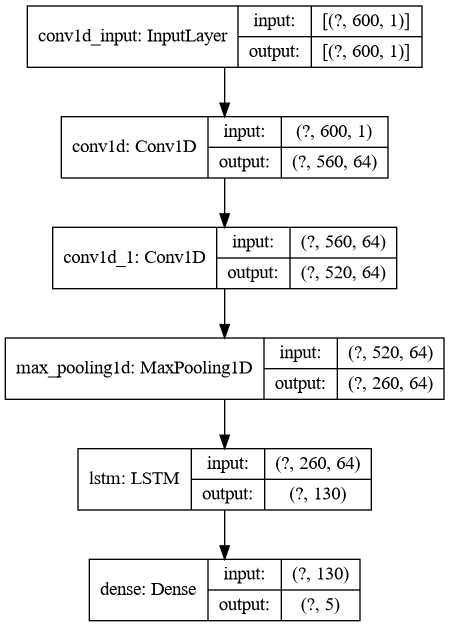
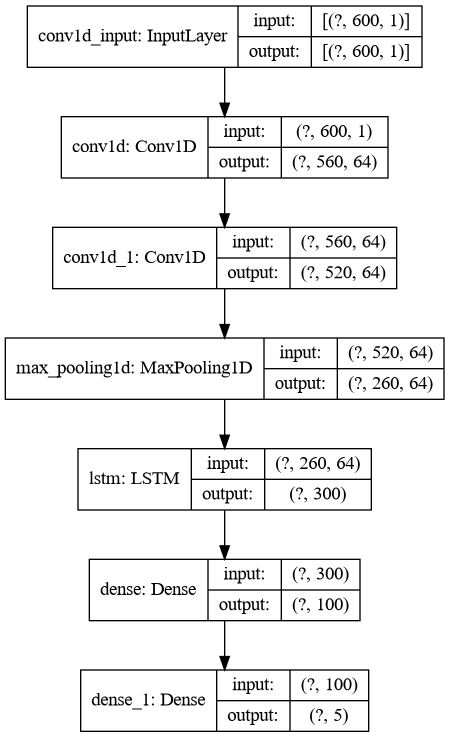
> 以上尝试均不行，模型拟合效果非常不好 20% 左右。
>
上面的这些结构，可能需要考虑调整结构后再进行测试。

参考 arxiv 上的两篇文献中提到内容，调整 CNN 以及 Dense 层中的使用 activation function (激活函数), 使用 elu 或 selu 来提升 cnn 中训练的速度，提高精准率 accuracy。 使用这些 relu 的 alternation 还可以避免 vanishing gradient 梯度消失问题， （之前常使用 relu 配合 kernel_initializer 来做 relu 的初始 weights 赋值）

> 1. [Fast and Accurate Deep Network Learning by Exponential Linear Units (ELUs)](https://arxiv.org/abs/1511.07289)
> 2. [Self-Normalizing Neural Networks](https://arxiv.org/abs/1706.02515)

> More details should go into above papers. issues like what drawbacks they introduced.
>
> TODO: The above papers needs to be read in more detail.


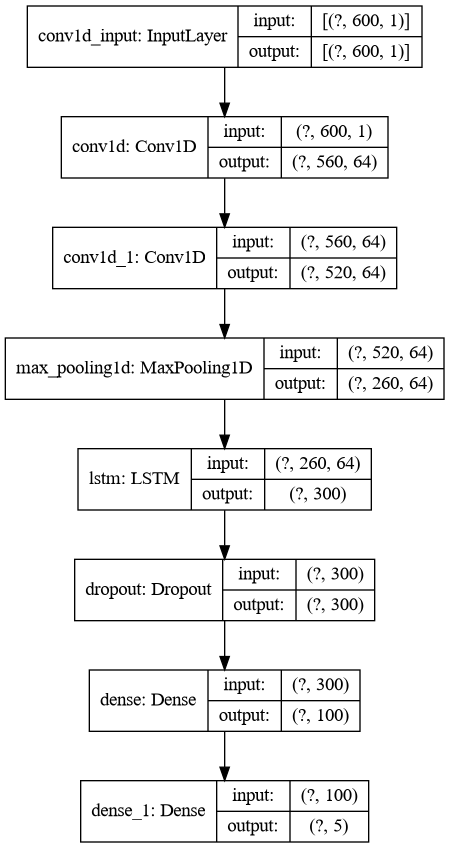
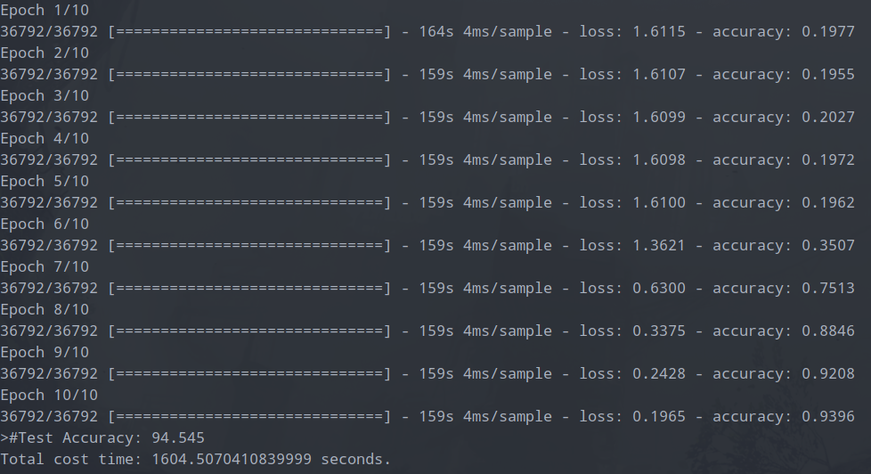

> 可以看到，从 第 6,7 epoch 开始，模型开始拟合训练数据。


#### Full CNNs with LSTM 

> reference: on arxiv
> [Multivariate LSTM-FCNs for Time Series Classification](https://arxiv.org/abs/1801.04503)
>
> TODO: this paper should be read in more detail

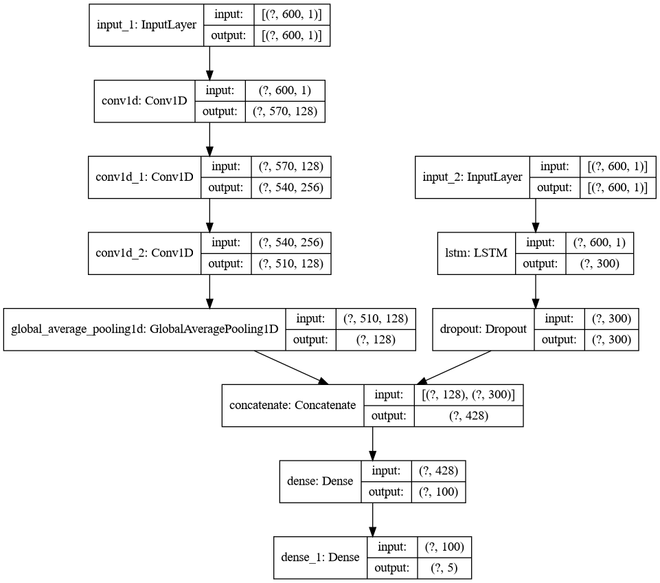
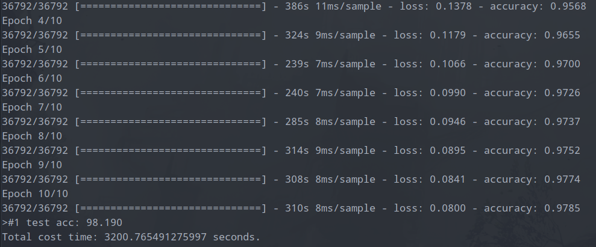


> 修改 kernel size 后进行的测试，仍有不错的效果。

> 这是一个可行的方案，但从之前的测试来看，只使用 cnn 卷积层也是能够获得非常不错的效果的，所有很难判断此模型中右边 LSTM 层在模型中贡献度分配的问题上有起到多少作用。
>
> 只使用三层卷积层叠加（结构的左边部分）来构建模型，与它进行对比看看。

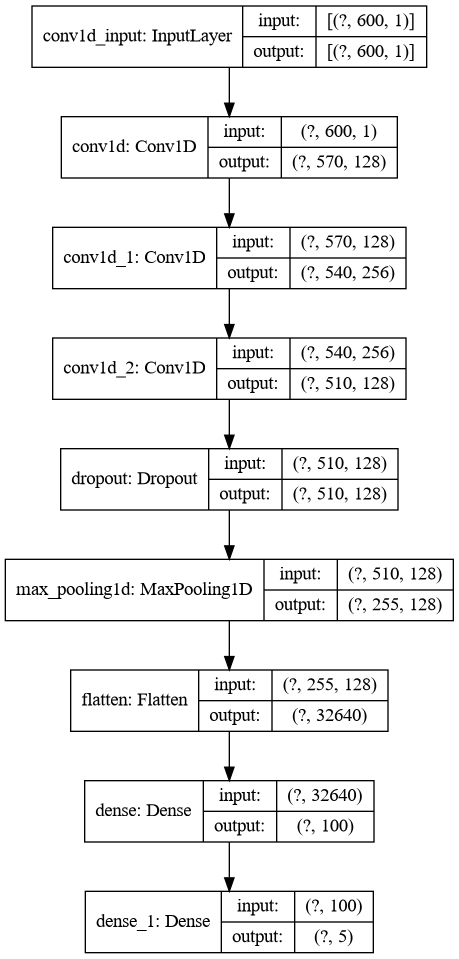
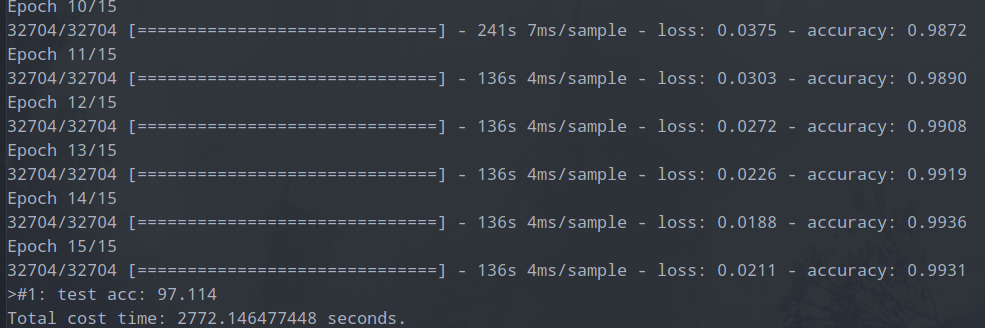
> 该结构表现出的效果与上面的双通道的效果很相近。

> 该模型值得考虑。 有非常大的概率 LSTM 没有拟合训练数据。


#### Applying new encoding approach

> 之前提到，对于文本分类问题，我们首先遇到的第一个问题就是如何将文本转换成数字，即如何进行编码。
> 之前使用的 Compact compressed character level encoding.

使用不同的对原始运行日志的编码方式，即简单地将 ascii 码转换成数字。

此时，我们转换成数字矩阵后的运行日志表示，它们的最大长度还是生成日志时的最大长度（不足长度的后面使用 0 进行填充）。在这种情况下，RNN 网络结构终于表示出非常不错的效果。

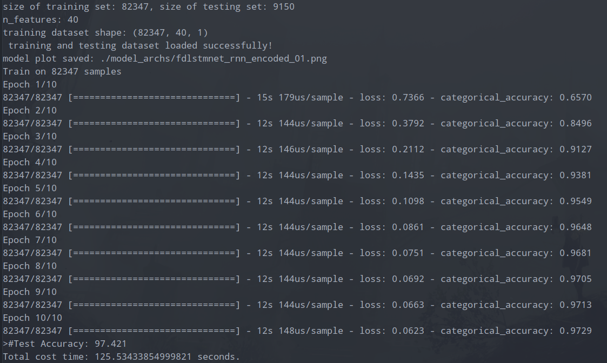

且由于模型的参数数量少，模型的训练时间也相应地减少了。
> 可见，此编码方式对于 RNN 网络结构是一种可行方案，后续应该将此编码方式应用于先前的 CNN 结构，以作对比。看看同样的编码方式能够在先前的 CNN 网络结构中也获得较好的效果。 (之前字符级别的编码方式对于 RNN 网络结构，可能由于表示的矩阵过于稀疏，表现效果非常不好)

## Issues

### data representations

如何更好的表示日志观察序列？

当前问题，即如何使用数据，表示数据 (表示学习，Representation learning), 特征工程 (feature engineering)。

可以先尝试自己使用传统的机器学习方法，用 MLP (multi-layer Perceptron network) 前馈网络来进行实验。之后再参考他人应用于文本序列分类的模型（通常是深度学习方法，即让模型自动做表示学习，自动抽取高层特征）。

> 放弃尝试手动进行特征抽取的方式，例如对于文本分类的传统处理方式，Bow (Bag of words) 需具备一定的专业知识专家才能来定所要使用的 vocabulary。 Word Embedding (词嵌入) 也是有类似的问题。

参考 **A Compact Encoding for Efficient Character-level Deep Text Classification-marinho2018** 中 Character-Level (字符级别) 紧凑编码来处理输入的日志中的观察。之后再考虑配合 CNNs 或 RNNs 或者 LSTM (Long Short Term Memory) 模型来训练。

> 1. [A Compact Encoding for Efficient Character-level Deep Text Classification](https://ieeexplore.ieee.org/document/8489139)
> 2. [Character-Level neural networks for short text classification](https://ieeexplore.ieee.org/document/8090812)

### Imbalanced dataset

产生的日志类别数量不平衡问题，如何解决？

对数量较多的类别使用 under sampling (欠采样)，以减少该类别训练数据的数量，而对数量少的类别样本使用 over sampling (过采样)，适当重复一些样本，以增加该类别的样本数量。

- [x] Code implementation.

### Over-sampling / Under sampling processing order

在当前实现方案中，对原始日志数据处理过后，如果产生多个 ``npz`` 文件，若不是使用所有的数据用于训练的话，当前的 over-sampling / under sampling 处理的时间点并不合理，我们的目的是对将要进行训练的数据进行类别的平衡，所有这种情况下，应该把 over-sampling / under-sampling 放到训练模型之前，读取 ``npz`` 数据之后。

- [ ] Code implementation.

### More efficient way to do convolution for the given sparse vectors (matrix).

当前代码实现中，由于预处理后的数据是表现为一个稀疏的矩阵（向量）,在模型训练时，直接计算卷积比较耗费计算资源。

TODO: 找寻更高效的稀疏矩阵卷积方式。

- [ ] Code implementation.

当前的处理方式是，一次性将所有待训练数据加载入内存中，然后进行卷积。

改进方案：
1. 分批次来加载待训练数据 ``generator`` 作为输入。
2. 稀疏矩阵的真正卷积方式，似乎 keras 定义的模型并没有提供直接的 API 来使用。使用 tf 应该可行，需要后续进行尝试。

直接使用 ``fitgenerator`` 来处理 scipy sparse matrices, 减少训练时占用的内存而已。 