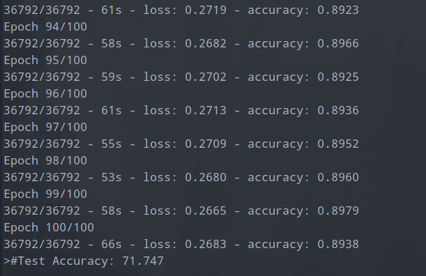
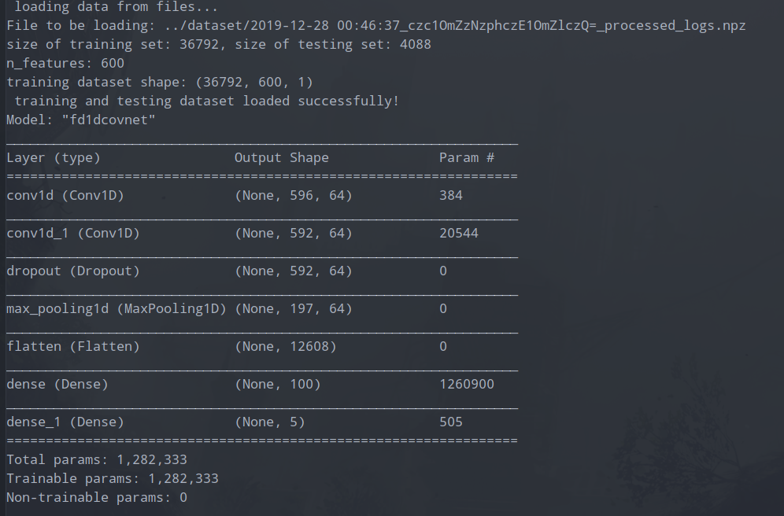
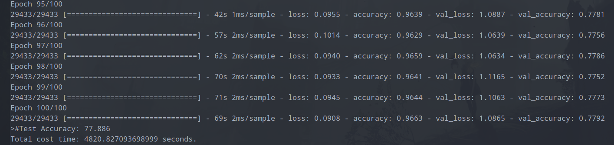
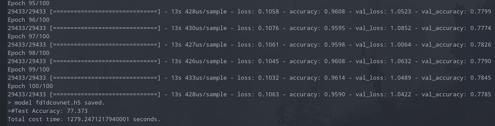
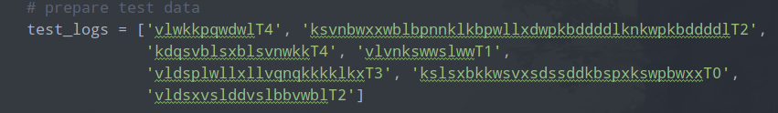
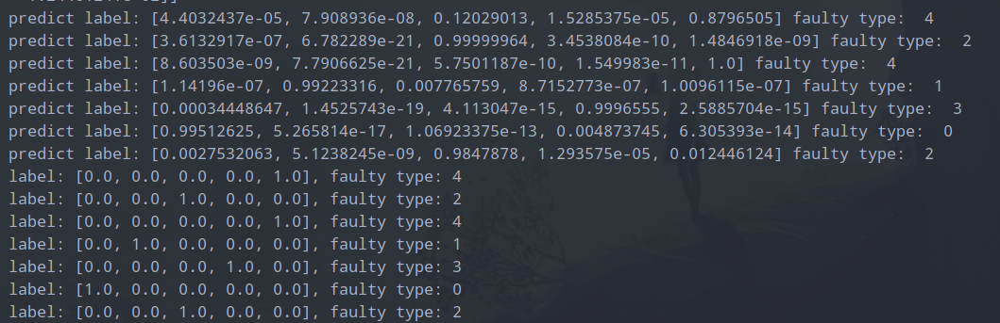
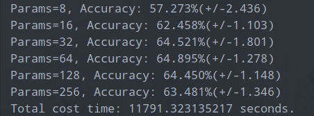
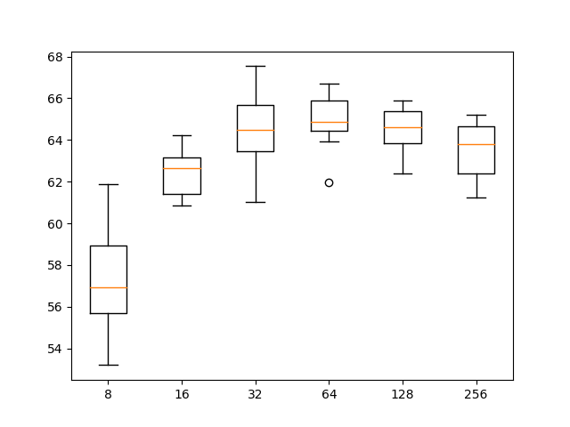
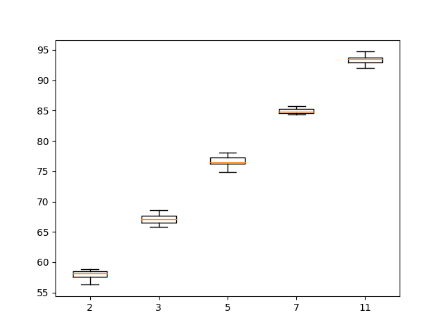

## Fault Diagnosis in unknown model DES

使用深度学习方法，基于 DES (离散事件系统) 生成的日志 (running logs) 来进行错误诊断，本质上是一个序列 (sequence) 的分类 (classification) 问题 .

> 即找寻适合该反复分类问题的机器学习方法，完成该任务。重点看如何借鉴已有对文本序列进行分类的例子，CNN (Convolution Neural Network) 或 RNN (Recurrent Neural Network) 可能可行。

### 1. Main Idea

Using one dimensional convolutional neural networks (CNNs), recurrent neural networks (RNNs) or long short term memory (LSTM)

RNNs and LSTM may does better than CNNs for this classification task.

### 2. 1D-CovNets

先尝试使用 1-DCovNets

参考: [https://machinelearningmastery.com/cnn-models-for-human-activity-recognition-time-series-classification/](https://machinelearningmastery.com/cnn-models-for-human-activity-recognition-time-series-classification/)

当前尝试方案:

刚开始尝试使用产生的数据量较大，编译的模型非常复杂，训练时间非常长（先放弃尝试了）

> 折中方案：选择随机状态大小为 50 ～ 100， 随机生成的日志长度限制为 30 ～ 50， 则预处理编码后产生的矩阵表示为 [1, 50 x (observable_event_set_size + 1)\]
> 产生的日志，经处理后，只剩 3 万多条，用于训练模型。训练时间大概为几分钟。

设置 ``epochs`` 为 100， 跑出来结果 (耗费时间 1 个多小时)

#### Hyperparameters tuning

调整 CNN 中调整的超参数。

##### 1. 一次随意尝试

将 ``kernel_size`` 从 ``3`` 调整为 ``7``， ``pool_size`` 从 ``2`` 调整为 ``5``， 并在拟合模型时将输入的训练集划分一部分 (0.2) 作为 validation set (验证集)。

Using gpu to reduce time for training.

加载已保存的模型，并从原始日志集中选取若干日志进行测试，来看模型是否能够预测出正确的错误类型:

选取的测试日志 (需要经过压缩编码后，再输入给模型):

预测情况如下：

> NOTICE: 可以看到，所有日志的预测结果都正确，但之前对模型的训练时的评估来看，我们选取的测试日志，很可能就是模型训练集中的样本。
> 因为在数据预处理时，由于每种类别的日志数量不均衡，进行了 over-sampling 以及 under-sampling， 之后再进行打乱 shuffle, 所以从原始的日志上看，无法知道那些是没用于训练的日志。（除非一开始就将原始数据进行划分）
>
> 从模型评估时模型在测试数据集上的表现 (准确率 77% 左右)来看，基本确定我们选取用于测试的数据应该就是包含于它的训练数据集中。🤔

##### 2. tuning number of filters

尝试调整 ``filters`` 数量 (产生的 feature map 数量)，将网络中所有 hyperparameters 调整为原始默认参数，并将 ``epochs`` 下调至 ``10``，减小迭代次数（减少训练所需的时间）
> 为了探索合适的 ``filters`` 大小，我们可以选取一个范围，小于初始值 ``64``的和大于初始值的。

> 完成测试，耗费大概 3 个多小时。 图中，accuracy 准确率是 mean 均值，后面跟着的是 std (standard deviation) 标准差。

> 从上图可以看到，随着 ``filters`` feature map 的数量的增加，测试准确率中值（黄色的线）在不断上升，而在 ``64`` 之后反而开始下降，因此，或许 ``64`` 就是合适的值，它同时具备性能和稳定性。
>
> 这么看，模型刚开始选择的 ``64`` 就是比较合适的值。。。

##### 3. tuning kernel size

调整 ``kernel`` (卷积的核或 filter 过滤器大小)，核的大小控制每次读取序列时要考虑的时间步长 (time steps), 然后将时间步长投影 (project) 到 feature map (特征映射，此过程为卷积)。较大的核意味着对输入读取不那么严格。
> 同样，我们可以选择一个范围的 ``kernel_size`` 来进行测试，其中包含初始建立网络选择的值 ``3``。

> 完成测试，所花费的时间还是 3 个多小时，测试集准确率是 mean 均值，后面是标准差。

> 从该盒形图中可以明显看出，随着 ``kernel_size`` 的增加，测试准确率中值（黄色线）不断上升，且所有超参数取值对应的测试准确率稳定性非常好。
>
> 从测试来看，``kernel_size`` 取 ``11`` 具有非常不错的效果。
>
> NOTICE: 从图上看，似乎我们还可以尝试取一个比 ``11`` 还大的范围来进行测试，看能否获得更好的效果。
>
> REMARKS: 原因分析：我们知道 kernel size 卷积核的大小是确定时间步长的大小，影响的是对输入序列消息的读取，从效果上看，随着 kernel size 的增大，模型效果越好。可能原因是，输入的数据从原始数据经过编码表示后，是一个维度较高且非常细稀疏的 tensor。适当增大 kernel size 反而能够更好处理这样的数据。

### 3. RNNs

### 4. LSTM

可先尝试只使用 LSTM 的方案。

Full CNNs with LSTM 

> reference: [https://paperswithcode.com/paper/multivariate-lstm-fcns-for-time-series](https://paperswithcode.com/paper/multivariate-lstm-fcns-for-time-series)

## Issues

1. 如何更好的表示日志观察序列？

当前问题，即如何使用数据，表示数据 (表示学习，Representation learning), 特征工程 (feature engineering)。

可以先尝试自己使用传统的机器学习方法，用 MLP (multi-layer Perceptron network) 前馈网络来进行实验。之后再参考他人应用于文本序列分类的模型（通常是深度学习方法，即让模型自动做表示学习，自动抽取高层特征）。

> 放弃尝试说手动进行特征抽取的方式，例如对于文本分类，Bow (Bag of words) 需具备一定的专业知识专家才能来定所要使用的 vocabulary。

参考 **A Compact Encoding for Efficient Character-level Deep Text Classification-marinho2018** 中 Character-Level (字符级别) 紧凑编码来处理输入的日志中的观察。之后再考虑配合 CNNs 或 RNNs 或者 LSTM (Long Short Term Memory) 模型来训练。

2. 产生的日志类别数量不平衡问题，如何解决？

对数量较多的类别使用 under sampling (欠采样)，以减少该类别训练数据的数量，而对数量少的类别样本使用 over sampling (过采样)，适当重复一些样本，以增加该类别的样本数量。