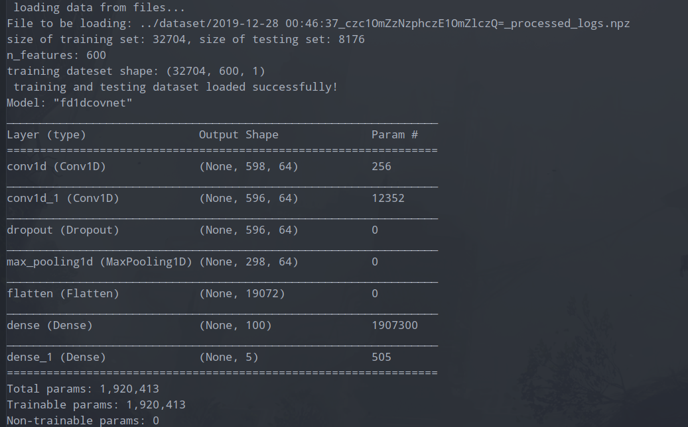
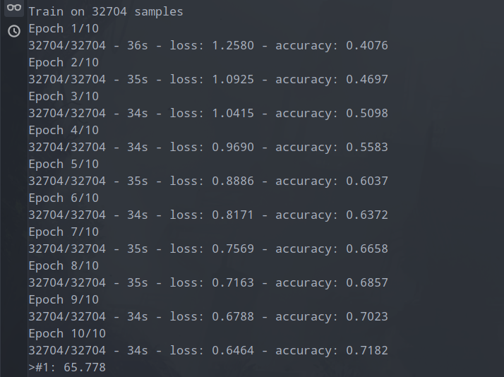

## Fault Diagnosis in unknown model DES

使用深度学习方法，基于 DES (离散事件系统) 生成的日志 (running logs) 来进行错误诊断，本质上是一个序列 (sequence) 的分类 (classification) 问题 .

> 即找寻适合该反复分类问题的机器学习方法，完成该任务。重点看如何借鉴已有对文本序列进行分类的例子，CNN (Convolution Neural Network) 或 RNN (Recurrent Neural Network) 可能可行。

### 1. Main Idea

Using one dimensional convolutional neural networks (CNNs), recurrent neural networks (RNNs) or long short term memory (LSTM)

RNNs and LSTM may does better than CNNs for this classification task.

### 2. 1D-CovNets

先尝试使用 1-DCovNets

参考: [https://machinelearningmastery.com/cnn-models-for-human-activity-recognition-time-series-classification/](https://machinelearningmastery.com/cnn-models-for-human-activity-recognition-time-series-classification/)

当前尝试方案:

刚开始尝试使用产生的数据量较大，编译的模型非常复杂，训练时间非常长（先放弃尝试了）

> 折中方案：选择随机状态大小为 50 ～ 100， 随机生成的日志长度限制为 30 ～ 50， 则预处理编码后产生的矩阵表示为 [1, 50 x (observable_event_set_size + 1)\]
> 产生的日志，经处理后，只剩 3 万多条，用于训练模型。训练时间大概为几分钟。

### 3. RNNs

### 4. LSTM

Full CNNs with LSTM 

> reference: [https://paperswithcode.com/paper/multivariate-lstm-fcns-for-time-series](https://paperswithcode.com/paper/multivariate-lstm-fcns-for-time-series)

## Issues

1. 如何更好的表示日志观察序列？

当前问题，即如何使用数据，表示数据 (表示学习，Representation learning), 特征工程 (feature engineering)。

可以先尝试自己使用传统的机器学习方法，用 MLP (multi-layer Perceptron network) 前馈网络来进行实验。之后再参考他人应用于文本序列分类的模型（通常是深度学习方法，即让模型自动做表示学习，自动抽取高层特征）。

> 放弃尝试说手动进行特征抽取的方式，例如对于文本分类，Bow (Bag of words) 需具备一定的专业知识专家才能来定所要使用的 vocabulary。

参考 **A Compact Encoding for Efficient Character-level Deep Text Classification-marinho2018** 中 Character-Level (字符级别) 紧凑编码来处理输入的日志中的观察。之后再考虑配合 CNNs 或 RNNs 或者 LSTM (Long Short Term Memory) 模型来训练。

2. 产生的日志类别数量不平衡问题，如何解决？

对数量较多的类别使用 under sampling (欠采样)，以减少该类别训练数据的数量，而对数量少的类别样本使用 over sampling (过采样)，适当重复一些样本，以增加该类别的样本数量。