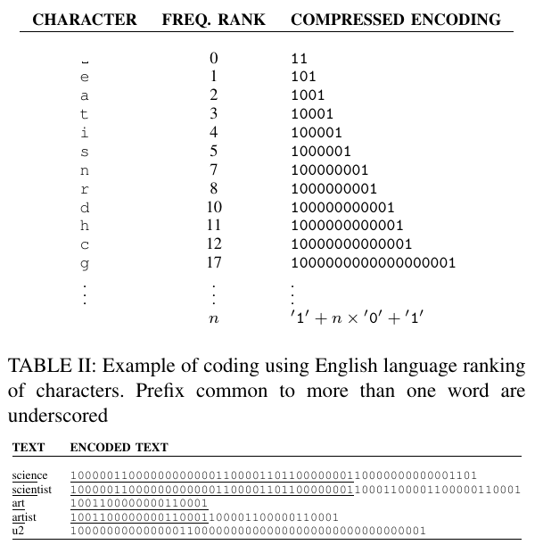
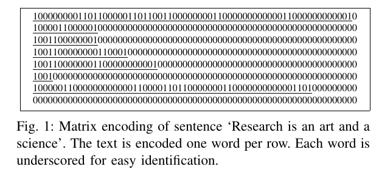
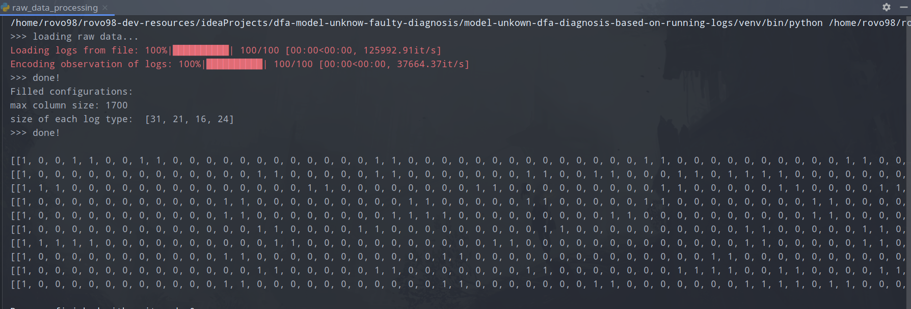

## Data Pre-Processing

### 1. for 1DCovNets

对于文本分类问题，使用 CNNs 面临的主要问题是如何将文本使用 numerical vector (数字向量) 来进行表示。

**A Compact Encoding for Efficient Character-level Deep Text Classification-marinho-2018** 中提供了一种紧凑的字符级别编码方案。

使用基于 tagged Huffman encoding 的修改版:

- 编码以两个``1`` 分别作为开始和结尾，使用若干个 ``0`` 作为信号；
- 需要先统计 vocabulary 中所有字符的词频，字符按照词频顺序来来排位，一个字符的编码中 ``0`` 的数量跟它的排位有关。

例子:
 

该论文中使用 ``number_of_words`` x ``maximum_len_of_word`` 的一个矩阵来表示一个文本，矩阵中没有占位的使用 ``0`` 进行填充。

回到研究的课题上，需要处理的序列是 running-logs 运行日志，是 DES 可观事件组成的序列，因此与编码有关的参数可能是：

1. size of observable events: 可观事件集的大小，以确定字符编码的最长长度；
2. length of running log in training data: 模型训练数据中日志的长度

> NOTICE: 
> - 为了方便起见，我们人为限制生成的 DFA (model of DES) 的 observable event set 仅由小写字母构成；
> - 目前，只需要关注训练数据中日志的长度（确定训练时用于表示日志的矩阵大小），训练完成后，使用模型来预测不在训练数据集中的日志时，如遇到日志过长，可以将日志分割成若干部分，对每个部分进行预测即可。（需要注意的是，这种处理方式只在我们只考虑 DES 建模的 DFA 只产生 single fault mode 单错误模式才行，如考虑多错误模模式，则可能需要对分割部分的预测结果进行组合处理，才能得到想要的结果）

压缩编码处理例子:

### for RNNs

由于之前我们假定 DES 的事件集的可用字符为小写字母，所以，对于时间序列数据，之前非常稀疏编码方式作为 RNNs 输入就不太合适（局部太稀疏了），这也是为什么使用之前 character-level encoding 要用比较大的 kernel size 的原因。

为此，我们采取相对简单的编码方式来处理，即 ASCII -> number。

### ISSUES

1. 数据量特别大时（大概 100 万条日志），如果一次性加载进内存，并进行压缩编码，会出现内存 RAM 耗尽问题。

> 可能的解决方案，尝试将已编码的日志分批次写入指定文件中，以减小内存使用压力。

2. sparse matrix 的处理以及储存

由于编码后产生的日志组成的矩阵是一个非常大的稀疏矩阵，考虑使用 ``numpy`` 以及 ``scipy`` 库提供的方法来进行压缩存储。
